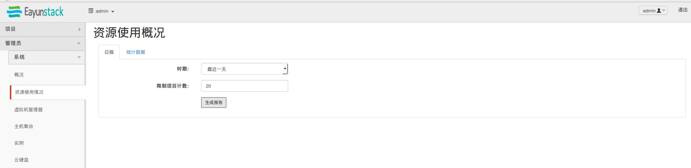
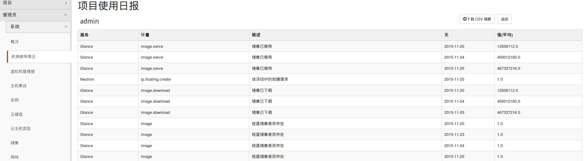
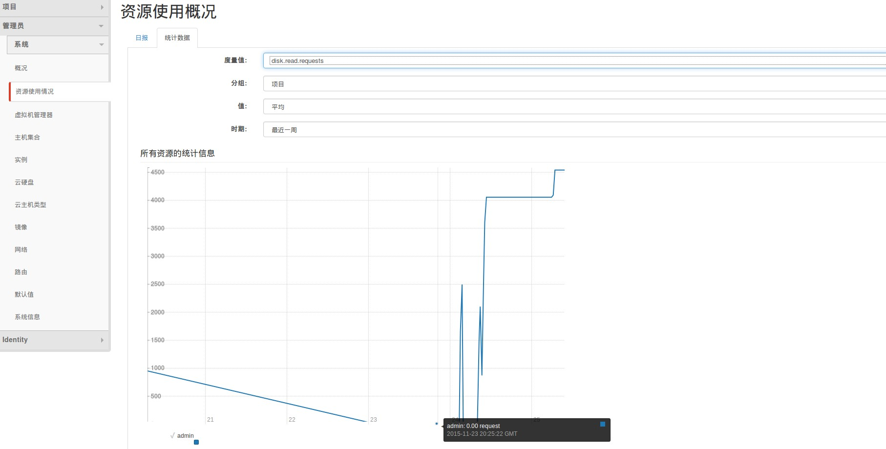

# 资源使用

　　通过horizon界面能够查询资源使用统计信息，分为日报与统计数据，通过admin用户登录，进入管理员标签下的资源使用情况进行查询．

### 日报查询

　　日报反映每个及单位的平均值，如下：

选择好时期，限制项目计数，点击生成报告，报告如下：

### 点击统计数据

　　统计数据，可根据采样进行数据统计，统计的筛选如下：

|名称|备注|
|-----|----|
|度量值|根据采样的的测量值|
|分组|目前支持按照项目分组|
|值|统计方式，如：平均,最大|
|时期|统计的时期方式|

点击统计数据，选择好度量值，时期，值后开始统计，统计结果如下:

