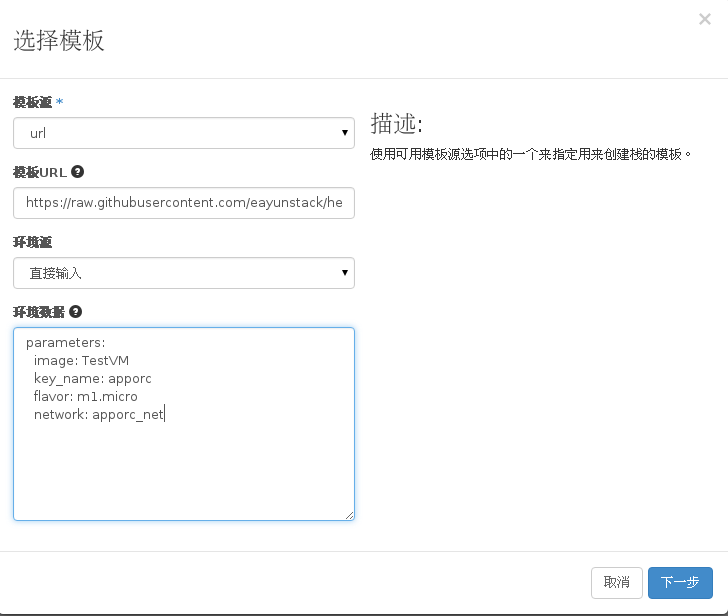
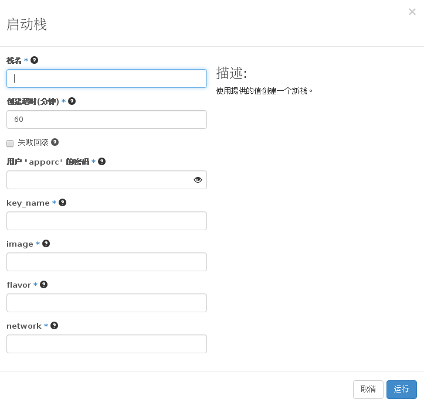

# 启动新的栈


### 通过Web horizon界面启动新的栈

* 点击启动栈，配置栈模板文件和环境文件

   

   栈模板文件可以选择本地文件，也可以填写一个链接。  
   环境文件可以选择本地文件，也可以直接输入。  
   栈模板文件与环境文件的写法，参见[高级管理](../advance_admin/heat_template.md)

* 填写栈的详细信息(填写栈名，超时时限，用户密码，密钥，镜像，规格和网络等)

   

   虽然之前可以将部分信息填写在环境文件中，但 horizon 界面仍会在这里特别  
   要求填写创建云主机资源所需的一些参数信息。

* 栈开始创建，等待一段时间后栈创建完成

### 通过命令方式启动新的栈

* 启动新的栈，执行如下命令

  > ```
  > heat stack-create --template-file <template file>--environment-file <environment file> <stack name>
  > ```

### 示例如下

```
# heat stack-create -f base.yaml -e base_env.yaml base_stack
+--------------------------------------+------------+--------------------+----------------------+
| id                                   | stack_name | stack_status       | creation_time        |
+--------------------------------------+------------+--------------------+----------------------+
| 194f47ee-c28b-4356-a7d3-3f74ce768bbd | base_stack | CREATE_IN_PROGRESS | 2015-11-24T08:58:45Z |
+--------------------------------------+------------+--------------------+----------------------+
```
