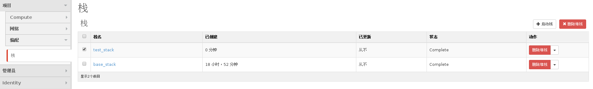
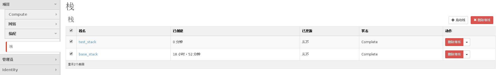

# 删除栈


### 通过Web horizon界面删除栈

* 勾选一个栈并点击左侧删除堆栈操作

 

* 勾选多个堆栈，并点击右上角删除堆栈操作，同时删除多个堆栈

 

* 无论哪种删除方式，等待删除操作后，在栈列表中，被删除的堆栈已消失

### 通过命令方式删除栈

* 删除堆栈，执行如下命令

  查看待删除堆栈名称与 ID
  > ```
  > heat stack-list
  > ```

  删除名称为 stack_name 或 ID 为 stack_id 的堆栈
  > ```
  > heat stack-delete <stack_name or stack_id>
  > ```

### 示例如下

```
# heat stack-list (查看所有堆栈列表)
+--------------------------------------+------------+--------------------+----------------------+
| id                                   | stack_name | stack_status       | creation_time        |
+--------------------------------------+------------+--------------------+----------------------+
| 194f47ee-c28b-4356-a7d3-3f74ce768bbd | base_stack | CREATE_COMPLETE    | 2015-11-24T08:58:45Z |
| e6ddd24f-a5b3-4928-94cc-4d0e40e98e29 | test_stack | CREATE_IN_PROGRESS | 2015-11-25T03:50:05Z |
+--------------------------------------+------------+--------------------+----------------------+
```

```
# heat stack-delete test_stack (指定删除 test_stack 这个堆栈)
+--------------------------------------+------------+-----------------+----------------------+
| id                                   | stack_name | stack_status    | creation_time        |
+--------------------------------------+------------+-----------------+----------------------+
| 194f47ee-c28b-4356-a7d3-3f74ce768bbd | base_stack | CREATE_COMPLETE | 2015-11-24T08:58:45Z |
+--------------------------------------+------------+-----------------+----------------------+
```
