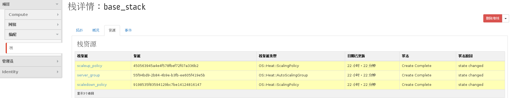

# 查看栈详情信息

### 通过Web horizon界面查看栈详情信息

栈详情包括拓扑、概况、资源、事件

* 栈详情（通过点击栈名称进入详情页）

  拓扑中是栈的一幅拓扑图，展示了栈中各个资源之间的的拓扑关系。

  

* 概况中显示了栈的名称、状态、输出以及栈参数等详细信息

  名称、ID、状态以及栈输出等信息
  栈输出是在栈模板中定义的反馈给用户的信息

  

  栈参数（栈所采用的镜像名、网络、密钥以及规格等参数）与启动参数（超时时限）
  

* 资源列表（一个栈包含多个资源，点击资源名称进入资源的详情页）

  

* 资源详情（资源 ID 与状态等）

  

* 事件列表（各个资源所发生的变动情况的列表）

  

### 通过命令方式查看栈详情信息

* 查看栈详情信息，执行如下命令

  显示名称为 stack_name 或 ID 为 stack_id 的栈详情
  > ``` heat stack-show <stack_name or stack_id>```

* 查看栈的资源列表

  显示名称为 stack_name 或 ID 为 stack_id 的资源列表
  > ``` heat resource-list <stack_name or stack_id>```

* 查看一个资源的详情

  显示资源名称为 resource_name 的详情
  > ``` heat  resource-show <stack_name or stack_id> <resource_name> ```

* 查看事件列表

  显示名称为 stack_name 或 ID 为 stack_id 的事件列表，包括资源名称、事件 ID 以及状态等信息
  > ``` heat event-list <stack_name or stack_id>```

* 查看事件详情

  显示事件 ID 为 event_id 的事件详情
  > ``` heat event-show <stack_name or stack_id> <resource_name> <event_id>```

* 查看栈输出列表

  显示名称为 stack_name 或 ID 为 stack_id 的栈输出列表
  > ``` heat output-list <stack_name or stack_id>```

* 查看输出详情

  显示名称为 output_name 的输出的详细情况
  > ``` heat output-show <stack_name or stack_id> <output_name>```

### 示例如下

```
[root@node-6 ~](fuel)# heat stack-show base_stack
+----------------------+-----------------------------------------------------------------------------------------------------------------------------------------------------------------------------------------------------------------------------------------------------------------------------------------------------------------------------------------------------------------------------------------------------------+
| Property             | Value
|
+----------------------+-----------------------------------------------------------------------------------------------------------------------------------------------------------------------------------------------------------------------------------------------------------------------------------------------------------------------------------------------------------------------------------------------------------+
| capabilities         | []
|
| creation_time        | 2015-11-24T08:58:45Z
|
| description          | AutoScaling Example
|
| disable_rollback     | True
|
| id                   | 194f47ee-c28b-4356-a7d3-3f74ce768bbd
|
| links                |
http://25.0.0.2:8004/v1/578cc76cce794f15ac5b6417b9480e26/stacks/base_stack/194f47ee-c28b-4356-a7d3-3f74ce768bbd (self)
|
| notification_topics  | []
|
| outputs              | [
|
|                      |   {
|
|                      |     "output_value":
"http://25.0.0.2:8000/v1/signal/arn%3Aopenstack%3Aheat%3A%3A578cc76cce794f15ac5b6417b9480e26%3Astacks%2Fbase_stack%2F194f47ee-c28b-4356-a7d3-3f74ce768bbd%2Fresources%2Fscaledown_policy?Timestamp=2015-11-24T08%3A58%3A58Z&SignatureMethod=HmacSHA256&AWSAccessKeyId=37fcc41e4cad46cd8f9e0220febf13cf&SignatureVersion=2&Signature=b3aVqwAmVkL3jhvhT5SjngK3Qbl8XKaepaAbf0y4umM%3D",
|
|                      |     "description": "This URL is the webhook to scale down the autoscaling group. You can invoke
the scale-down operation by doing an HTTP POST to this URL; no body nor extra headers are needed.\n",
|
|                      |     "output_key": "scale_dn_url"
|
|                      |   },
|
|                      |   {
|
|                      |     "output_value":
"http://25.0.0.2:8000/v1/signal/arn%3Aopenstack%3Aheat%3A%3A578cc76cce794f15ac5b6417b9480e26%3Astacks%2Fbase_stack%2F194f47ee-c28b-4356-a7d3-3f74ce768bbd%2Fresources%2Fscaleup_policy?Timestamp=2015-11-24T08%3A58%3A59Z&SignatureMethod=HmacSHA256&AWSAccessKeyId=bff861c038ab4ac789def7cf29e78e00&SignatureVersion=2&Signature=UAGwhdJProzV9GmcdNIaebyfsJfluvl0TB2i6L4mXLA%3D",
|
|                      |     "description": "This URL is the webhook to scale up the autoscaling group.  You can invoke
the scale-up operation by doing an HTTP POST to this URL; no body nor extra headers are needed.\n",
|
|                      |     "output_key": "scale_up_url"
|
|                      |   }
|
|                      | ]
|
| parameters           | {
|
|                      |   "network": "apporc_net",
|
|                      |   "OS::stack_id": "194f47ee-c28b-4356-a7d3-3f74ce768bbd",
|
|                      |   "OS::stack_name": "base_stack",
|
|                      |   "key_name": "apporc",
|
|                      |   "image": "TestVM",
|
|                      |   "flavor": "m1.micro"
|
|                      | }
|
| parent               | None
|
| stack_name           | base_stack
|
| stack_owner          | apporc
|
| stack_status         | CREATE_COMPLETE
|
| stack_status_reason  | Stack CREATE completed successfully
|
| template_description | AutoScaling Example
|
| timeout_mins         | None
|
| updated_time         | None
|
+----------------------+-----------------------------------------------------------------------------------------------------------------------------------------------------------------------------------------------------------------------------------------------------------------------------------------------------------------------------------------------------------------------------------------------------------+
```

```
# heat resource-list base_stack
+------------------+--------------------------------------+----------------------------+-----------------+----------------------+
| resource_name    | physical_resource_id                 | resource_type              | resource_status | updated_time         |
+------------------+--------------------------------------+----------------------------+-----------------+----------------------+
| server_group     | 55f94bd9-2b84-4b9e-b3fb-ee605f419e5b | OS::Heat::AutoScalingGroup | CREATE_COMPLETE | 2015-11-24T08:58:45Z |
| scaledown_policy | 9198535f83594129bc7be14124816147     | OS::Heat::ScalingPolicy    | CREATE_COMPLETE | 2015-11-24T08:58:58Z |
| scaleup_policy   | 450563945a4e4f578fbef72f07a336b2     | OS::Heat::ScalingPolicy    | CREATE_COMPLETE | 2015-11-24T08:58:59Z |
+------------------+--------------------------------------+----------------------------+-----------------+----------------------+
```

```
# heat  resource-show base_stack server_group
+------------------------+----------------------------------------------------------------------------------------------------------------------------------------------------+
| Property               | Value                                                                                                                                              |
+------------------------+----------------------------------------------------------------------------------------------------------------------------------------------------+
| description            |                                                                                                                                                    |
| links                  | http://25.0.0.2:8004/v1/578cc76cce794f15ac5b6417b9480e26/stacks/base_stack/194f47ee-c28b-4356-a7d3-3f74ce768bbd/resources/server_group (self)      |
|                        | http://25.0.0.2:8004/v1/578cc76cce794f15ac5b6417b9480e26/stacks/base_stack/194f47ee-c28b-4356-a7d3-3f74ce768bbd (stack)                            |
|                        | http://25.0.0.2:8004/v1/578cc76cce794f15ac5b6417b9480e26/stacks/base_stack-server_group-mqszhjbvpnk7/55f94bd9-2b84-4b9e-b3fb-ee605f419e5b (nested) |
| logical_resource_id    | server_group                                                                                                                                       |
| physical_resource_id   | 55f94bd9-2b84-4b9e-b3fb-ee605f419e5b                                                                                                               |
| required_by            | scaleup_policy                                                                                                                                     |
|                        | scaledown_policy                                                                                                                                   |
| resource_name          | server_group                                                                                                                                       |
| resource_status        | CREATE_COMPLETE                                                                                                                                    |
| resource_status_reason | state changed                                                                                                                                      |
| resource_type          | OS::Heat::AutoScalingGroup                                                                                                                         |
| updated_time           | 2015-11-24T08:58:45Z                                                                                                                               |
+------------------------+----------------------------------------------------------------------------------------------------------------------------------------------------+
```

```
# heat event-list base_stack
+------------------+--------------------------------------+------------------------+--------------------+----------------------+
| resource_name    | id                                   | resource_status_reason | resource_status    | event_time           |
+------------------+--------------------------------------+------------------------+--------------------+----------------------+
| scaleup_policy   | 51b93a79-65e0-4f86-bd97-493055dfb85f | state changed          | CREATE_COMPLETE    | 2015-11-24T08:59:00Z |
| scaledown_policy | 2ecf6711-6e69-4c68-9e98-90b58d33c6f3 | state changed          | CREATE_COMPLETE    | 2015-11-24T08:59:00Z |
| scaleup_policy   | aae118ec-c010-4a10-8dca-0df11b9d8184 | state changed          | CREATE_IN_PROGRESS | 2015-11-24T08:58:59Z |
| scaledown_policy | 2c3bebc8-d0f6-4653-945f-31bcab874f81 | state changed          | CREATE_IN_PROGRESS | 2015-11-24T08:58:58Z |
| server_group     | 5d47f50e-ed8a-4391-b88b-ac044fdc771f | state changed          | CREATE_COMPLETE    | 2015-11-24T08:58:58Z |
| server_group     | c4440974-fe65-4915-9c49-89d14db4776c | state changed          | CREATE_IN_PROGRESS | 2015-11-24T08:58:45Z |
+------------------+--------------------------------------+------------------------+--------------------+----------------------+
```

```
# heat event-show base_stack scaleup_policy 51b93a79-65e0-4f86-bd97-493055dfb85f
+------------------------+---------------------------------------------------------------------------------------------------------------------------------------------------------------------------------------------+
| Property               | Value
|
+------------------------+---------------------------------------------------------------------------------------------------------------------------------------------------------------------------------------------+
| event_time             | 2015-11-24T08:59:00Z
|
| id                     | 51b93a79-65e0-4f86-bd97-493055dfb85f
|
| links                  |
http://25.0.0.2:8004/v1/578cc76cce794f15ac5b6417b9480e26/stacks/base_stack/194f47ee-c28b-4356-a7d3-3f74ce768bbd/resources/scaleup_policy/events/51b93a79-65e0-4f86-bd97-493055dfb85f
(self) |
|                        |
http://25.0.0.2:8004/v1/578cc76cce794f15ac5b6417b9480e26/stacks/base_stack/194f47ee-c28b-4356-a7d3-3f74ce768bbd/resources/scaleup_policy
(resource)                                         |
|                        |
http://25.0.0.2:8004/v1/578cc76cce794f15ac5b6417b9480e26/stacks/base_stack/194f47ee-c28b-4356-a7d3-3f74ce768bbd (stack)
|
| logical_resource_id    | scaleup_policy
|
| physical_resource_id   | 450563945a4e4f578fbef72f07a336b2
|
| resource_name          | scaleup_policy
|
| resource_properties    | {
|
|                        |   "auto_scaling_group_id": "base_stack-server_group-mqszhjbvpnk7",
|
|                        |   "adjustment_type": "change_in_capacity",
|
|                        |   "scaling_adjustment": 1,
|
|                        |   "cooldown": 60
|
|                        | }
|
| resource_status        | CREATE_COMPLETE
|
| resource_status_reason | state changed
|
| resource_type          | OS::Heat::ScalingPolicy
|
+------------------------+---------------------------------------------------------------------------------------------------------------------------------------------------------------------------------------------+
```

```
# heat  output-list base_stack
+--------------+-------------------------------------------------------------------------------------------------------------------------------------------------------------------------------+
| output_key   | description                                                                                                                                                                   |
+--------------+-------------------------------------------------------------------------------------------------------------------------------------------------------------------------------+
| scale_dn_url | This URL is the webhook to scale down the autoscaling group. You can invoke the scale-down operation by doing an HTTP POST to this URL; no body nor extra headers are needed. |
|              |                                                                                                                                                                               |
| scale_up_url | This URL is the webhook to scale up the autoscaling group.  You can invoke the scale-up operation by doing an HTTP POST to this URL; no body nor extra headers are needed.    |
|              |                                                                                                                                                                               |
+--------------+-------------------------------------------------------------------------------------------------------------------------------------------------------------------------------+
```

```
# heat output-show base_stack scale_dn_url
"http://25.0.0.2:8000/v1/signal/arn%3Aopenstack%3Aheat%3A%3A578cc76cce794f15ac5b6417b9480e26%3Astacks%2Fbase_stack%2F194f47ee-c28b-4356-a7d3-3f74ce768bbd%2Fresources%2Fscaledown_policy?Timestamp=2015-11-24T08%3A58%3A58Z&SignatureMethod=HmacSHA256&AWSAccessKeyId=37fcc41e4cad46cd8f9e0220febf13cf&SignatureVersion=2&Signature=b3aVqwAmVkL3jhvhT5SjngK3Qbl8XKaepaAbf0y4umM%3D"

```
