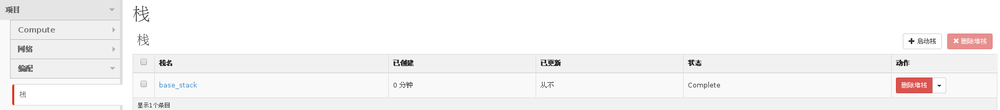

# 查看栈列表


### 通过 Web horizon 界面查看栈列表

通过登录 horzion 查看当前项目下栈列表，登录后选择项目----编配----栈，显示栈

 

**注意**：目前 horizon 界面并未提供显示所有项目下栈列表的方式。

### 通过命令行查看栈列表

* 查看当前项目下栈列表，执行如下命令

  > ```heat stack-list```

* 查看所有项目下栈列表，执行如下命令

  > ```heat stack-list --global-tenant```

**注意**：/etc/heat/policy.json 中默认没有打开使用该选项的权限，打开方法见下文

### 允许 admin 使用 --global-tenant 选项

* 更改配置文件

  > ``` sed -i 's/"stacks:global_index": "deny_everybody",/"stacks:global_index": "is_admin:True",/' /etc/heat/policy.json```

* 重启 heat-api 服务

  > ``` systemctl restart openstack-heat-api ```

### 示例如下：

```
# heat stack-list
+--------------------------------------+------------+-----------------+----------------------+
| id                                   | stack_name | stack_status    | creation_time        |
+--------------------------------------+------------+-----------------+----------------------+
| 194f47ee-c28b-4356-a7d3-3f74ce768bbd | base_stack | CREATE_COMPLETE | 2015-11-24T08:58:45Z |
+--------------------------------------+------------+-----------------+----------------------+
```

```
# heat stack-list -g 
+--------------------------------------+---------------+----------------------------------+-------------+-----------------+----------------------+
| id                                   | stack_name    | project                          | stack_owner | stack_status    | creation_time        |
+--------------------------------------+---------------+----------------------------------+-------------+-----------------+----------------------+
| 259265af-6d52-4ee6-85da-1d962526d358 | base1         | 3846bfe69b4a49948b8056d5f9c76859 | admin       | CREATE_FAILED   | 2015-10-21T02:19:20Z |
| 39e48597-5509-40fb-b986-b9c663f4d301 | base2         | 3846bfe69b4a49948b8056d5f9c76859 | admin       | CREATE_COMPLETE | 2015-10-21T02:21:25Z |
| 4b6778ea-788e-4a89-91df-6abe78ef1dc6 | withalarm     | 3846bfe69b4a49948b8056d5f9c76859 | admin       | CREATE_COMPLETE | 2015-10-21T02:33:21Z |
| 5254907d-a558-450f-8d08-4fdeb14bf0e4 | base          | 3846bfe69b4a49948b8056d5f9c76859 | admin       | CREATE_COMPLETE | 2015-10-21T02:09:45Z |
| 194f47ee-c28b-4356-a7d3-3f74ce768bbd | base_stack    | 578cc76cce794f15ac5b6417b9480e26 | apporc      | CREATE_COMPLETE | 2015-11-24T08:58:45Z |
| 702c0b4d-751b-4fd1-9c35-f9bb9f8676b7 | coffee_withlb | bf87349ae6704a87af75ebe9546d4af6 | rally_admin | CREATE_COMPLETE | 2015-10-10T03:55:40Z |
+--------------------------------------+---------------+----------------------------------+-------------+-----------------+----------------------+
```
