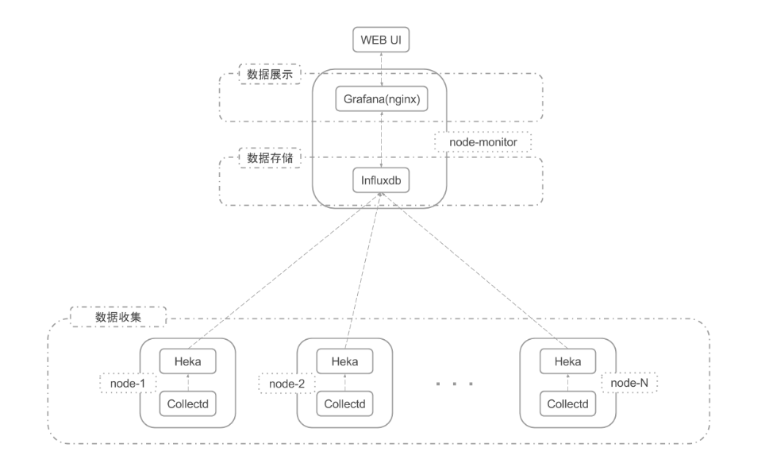

# 平台架构

整个监控平台由三部分组成（参考上图）：数据收集模块、数据存储模块及数据展示模块。

* 数据收集

数据收集模块由 Collectd + Heka 两个开源软件组成，Collectd 主要负责系统基本状态信息、OpenStack 各服务状态信息及各集群状态信息的收集，将收集到的信息发送给 Heka；Heka 主要负责 OpenStack 各组件日志的收集，同时对 Collectd 收集到的信息及 OpenStack 各组件日志信息进行解码、过滤等处理，然后将处理过的数据实时发送到 Influxdb 数据库。Collectd 及 Heka 均支持自定义插件，因此我们可以通过自定义插件来实现对自己开发的功能的监控。

* 数据存储

数据存储模块功能由开源数据库 InfluxDB 提供，InfluxDB 是一个开源，分布式，时间序列，事件，可度量和无外部依赖的数据库。所有 OpenStack 节点的监控数据都存储在该数据库中。该数据库支持HTTP API，用户可以通过 HTTP API 对数据库进行读写操作。

* 数据展示

数据展示模块功能由开源软件 Grafana 提供，部署在 Nginx 上，它可以将从 InfluxDB 数据库中获取到的实时监控数据通过图表的形式展示出来。Grafana 支持用户自定义图表，当我们需要对自己开发的功能进行监控时，可以非常方便的增加相关监控图表。
