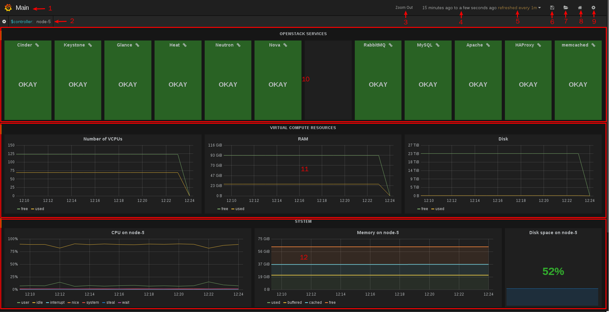
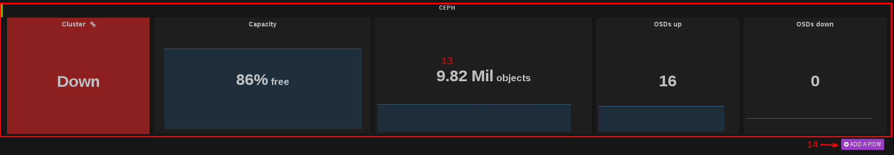
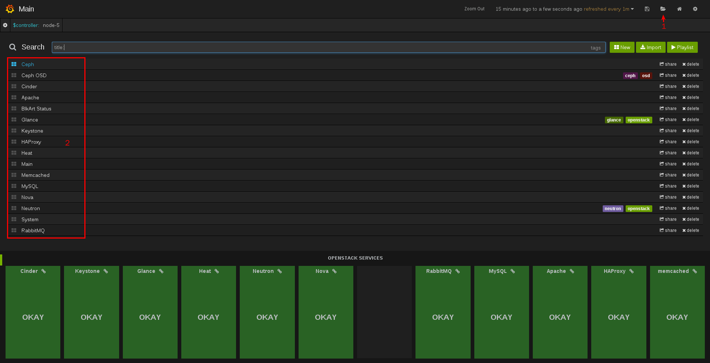
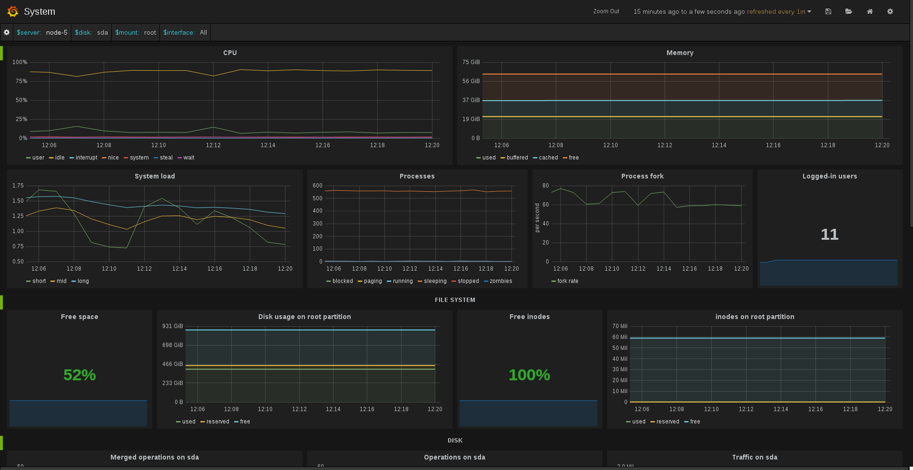
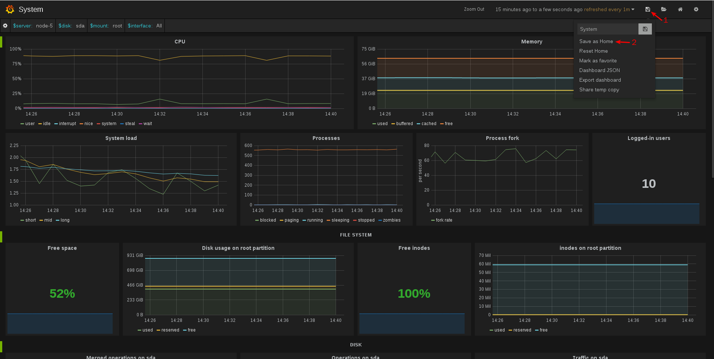
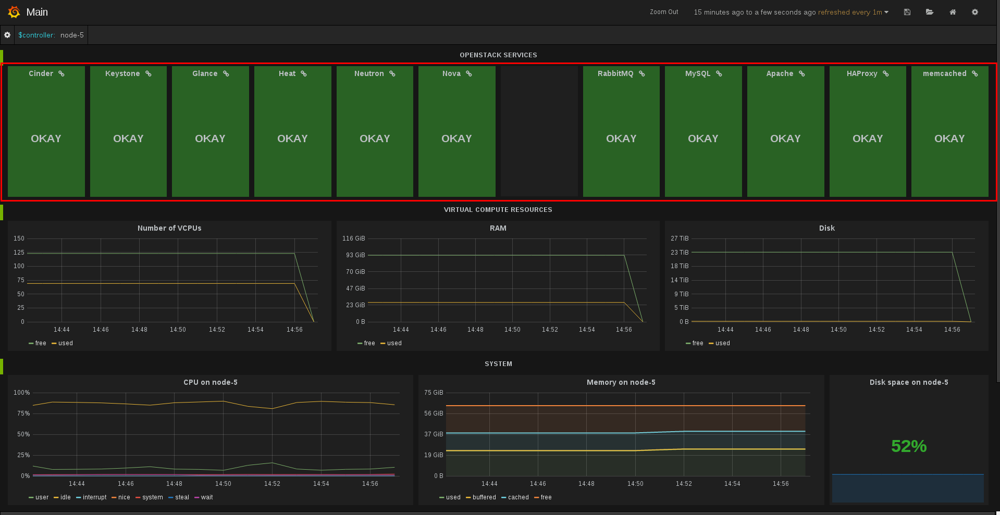
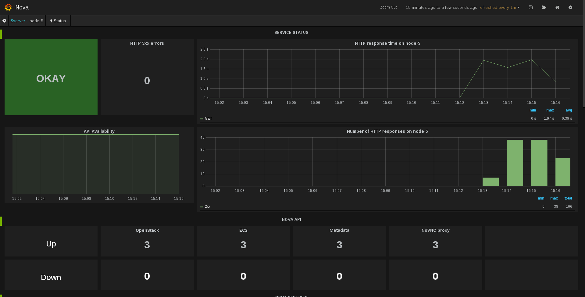

# 使用方法

监控平台部署完成后，用户可以通过浏览器访问监控节点（Influxdb节点）的外网 IP 地址访问监控平台的 WEB UI。WEB UI 默认提供了 Main、Cinder、Keystone、Glance、Heat、Neutron、Nova、RabbitMQ、MySQL、Apache、HAProxy、memcached、Ceph、Ceph OSD、System 15个 Dashboard，用来对不同的资源状态进行展示。下面介绍下 WEB UI 的基本使用方法。

## 界面简介

* **1：** 当前查看的 Dashboard 的名称
* **2：** Controller 节点列表，点击此处可展开选择不同的 Controller 节点进行查看
* **3：** 查看指定时间范围里的监控数据
* **4：** 当前展示的监控数据的时间范围，可以点击此处修改时间范围
* **5：** 自动刷新的频率，可以点击此处修改刷新频率
* **6：** 保存对当前 Dashboard 的修改
* **7：** Dashboard 文件夹，点击展开可搜索或查看其他 Dashboard
* **8：** 返回默认主界面
* **9：** Dashboard 设置
* **10：** OpenStack Service 状态概览
* **11：** OpenStack 环境 Virtual Compute Resource 状态概览
* **12：** 当前选定的 Controller 节点系统状态概览
* **13：** Ceph 集群状态概览
* **14：** 创建一个新行（可用于创建自定义监控面板）

## 查看其他 Dashboard（方法1）

* **1：** 点击 Dashboard 文件夹按钮
* **2：** 选择想要查看的 Dashboard 点击即可调转到对应的 Dashboard（例如点击 System 即可调转到 System Dashboard，如下图）

## 将当前 Dashboard 设置为默认主页

* **1：** 点击“保存”按钮
* **2：** 点击“Save as Home”将当前 Dashboard 设置为默认主页

## 查看其他 Dashboard（方法2）

除了从 Dashboard 文件夹中访问其他 Dashboard 外，WEB UI 还提供了另外一种快速访问其他 Dashboard 的方法，示例如下。

* 选择红框中任意一个服务单击即可查看对应服务的 Dashboard，例如单击“Nova”，即可查看 Nova 服务相关的 Dashboard，如下图。

